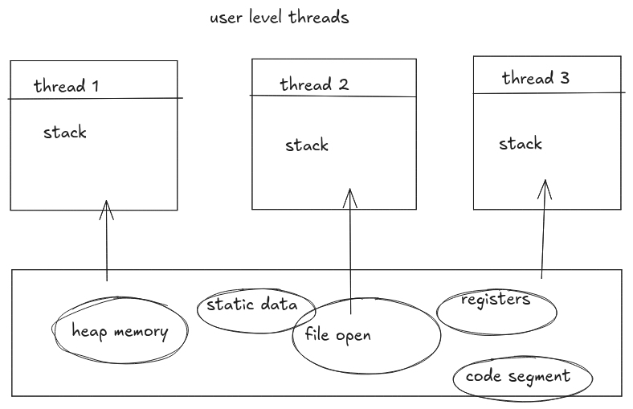
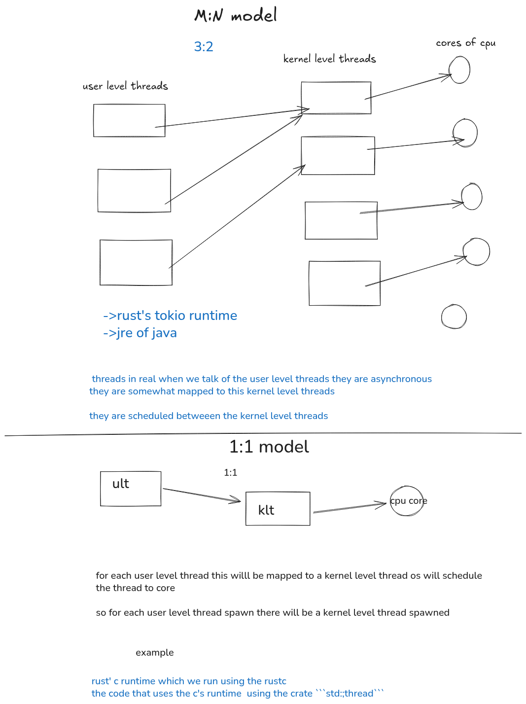
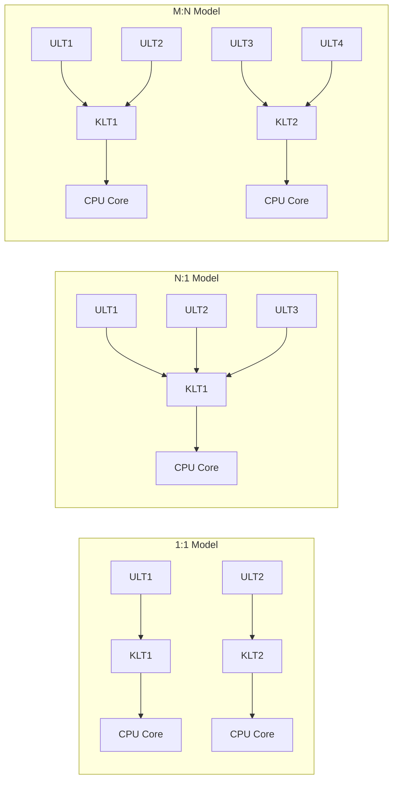

# Threading

> there are two types of thread **user level thread** and 
> kernel level threads  
> 
## User level thread VS Kernel level Thread


| Feature                  | User-Level Threads                          | Kernel-Level Threads                        |
|---------------------------|---------------------------------------------|---------------------------------------------|
| Managed By               | User space libraries                        | Operating system kernel                     |
| Context Switch           | Faster (no kernel involvement)              | Slower (involves kernel mode)               |
| OS Awareness             | OS is unaware of threads                    | OS fully aware of threads                   |
| Portability              | More portable across OS                     | Less portable (OS dependent)                |
| Blocking                 | If one thread blocks, all may block         | If one thread blocks, others can continue   |
| Scheduling               | Done by user-level thread library           | Done by the kernel scheduler                |
| Performance              | Low overhead, efficient for many threads    | Higher overhead, better CPU concurrency     |
| Multiprocessor Utilization | Cannot directly use multiple CPUs          | Can run on multiple processors simultaneously |

* ### kernel level thread is the true parallelism
* ### each kernel level thread run on one cpu
* ### user level threads are not visible to the os
* ### os sees the user level threads ,it only sees the process and the thread inside of that as one single thread







## Mutex Working 
* `Mutex<T>` is a smart pointer. More accurately, the call to `lock`  _returns_ a smart pointer called `MutexGuard`
* MutexGuard implements the trait Deref hence the data inside of it can be treated like a regular reference like this way
   ```
   use std::sync::Mutex;
    fn main()
    {
    let v=Mutex::new(23);
    //when u lock u get the mutex guard MutexGuard<u32>
    {
    let x=v.lock().unwrap();
    *x+=23;
    }
    }
    ```
 *  the smart pointer also has a `Drop` implementation that releases the lock automatically when a `MutexGuard` goes out of scope
    

